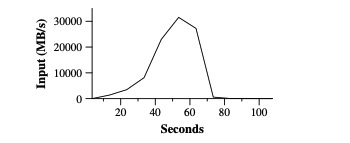
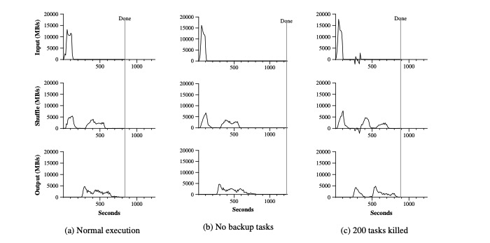
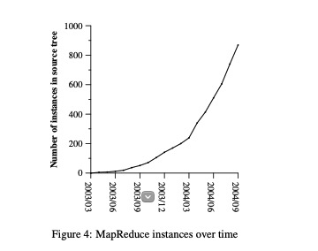

### 映射（MAP）-归约(REDUCE)：大型集群应用下简化数据解析

#### 摘要

​		**MapReduce** 是一种为解析生成大规模数据集而实现的编程模型。用户指定一个**map**函数，用于解析 **k/v** 键值对数据集并生成新（中间）的 **k/v** 键值对数据集；同时指定 **reduce** 函数用于合并所有包含相同中间键的中间值（新的键值对）。如本文所述，许多现实世界中的任务均可用该模型表述。

​		这种函数式风格的程序会自动并行的运行在大型商业集群环境下。运行系统负责切分输入数据的详情，调度程序在集群机器上执行，处理机器故障及内部机器间的通信。这使没有并行和分布式系统经验的工程师可以轻松利用大型分布式系统的资源。

​		我们实现的 **MapReduce** 运行在大型商业集群环境上，并且可高度扩展；一个典型的 **MapReduce** 计算可以在上千台机器上处理上 **TB** 的数据。工程师发现该系统非常易用：已经实施了数百个 **MapReduce** 程序，并且谷歌的集群上每天都执行着上千的 **MapReduce** 任务。

#### 1. 介绍

​		在过去五年里，作者们在谷歌已经实现了数百种特殊用途的计算，用于处理大量原始数据，比如爬虫文档、**web** 请求日志等。计算各种各样的衍生数据，比如倒排索引、各种 **web** 文档的图行结构声明、每个主机爬取的页面摘要、给定时间的高频查询集合等。大多数此类计算在概念上都是易懂的，然而输入数据通常较大，计算任务不得不被分布到成百上千的机器上保证在适当的时间内去完成。如何保证并行计算、分布数据、故障处理？解决这些问题会产生大量复杂代码并掩盖原本简单的计算操作。

​		为了应对这种复杂性。我们设计了一种能够表述我们试图执行的简单计算的抽象，但是我们将并行计算、容错、数据分布以及负载均衡的细节处理隐藏在库中。我们的抽象灵感来自 **map** 和 **reduce** 在 **Lisp** 和其它函数式编程语言的早期实现。我们意识到大部分计算都涉及对输入数据中的逻辑记录应用 **map** 操作，以便计算得到一组中间 **k/v** 键值对，然后对所有包含相同键的值进行 **reduce** 操作，以便适当的组合这些导出数据。我们对用户自定义的 **map** 和 **reduce** 操作使用函数模型，这使得我们能够轻松的进行大型并行计算，同时让重新执行作为容错的主要机制。

​		这项工作的主要共享是一个简单且强大的接口，这个接口保证了大规模计算的自动并行和分布式操作，结合该接口的实现可以在大规模商业PC机器上保证高性能。

​		第二节描述了编程模型的基础，并给出了几个示例。第三节描述了一个基于集群计算环境下 **MapReduce** 接口的实现。第四节描述了我们针对编程模型已发现的几点有效改进。第五节有针对几项任务的性能衡量。第六节探讨了 **MapReduce** 在 **Google** 中的用法，包括我们使用它作为重写生产索引系统基础的经验。第七节讨论未来相关的工作。

#### 2. 编程模型

​		计算任务接收一个 **k/v** 键值对集合作为输入，并生成一个新的 **k/v** 键值对集合作为输出，**MapReduce** 库通过 **Map** 和 **Reduce** 函数表示计算。

​		用户编写的 **Map** 函数接收一个输入对并生成一个中间的 **k/v** 键值对。**MapReduce ** 库会将所有拥有相同中间键 ***I*** 的中间值分组并传递给 **Reduce ** 函数。

​		**Reduce ** 函数同样由用户编写，该函数接收一个中间键 ***I*** 和与该中间键关联的值集合，它将这些值合并在一起以形成可能较小的一组值。

​		通常一次 **Reduce ** 调用只会生成零个或一个输出值。中间值通过迭代器提供给用户的 **Reduce ** 函数。这使我们能够处理太大而无法容纳在内存中的值列表。

##### 2.1 示例

​		考虑对大量文档中每个单词的出现次数进行计数的问题。用户将编写类似如下的伪代码：

```
map(String key, String value):
    // key: document name
    // value: document contents
    for each word w in value:
        EmitIntermediate(w, "1");

reduce(String key, Iterator values):
    // key: a word
    // values: a list of counts
    int result = 0;
    for each v in values:
        result += ParseInt(v);
        Emit(AsString(result));
```

​		**map** 函数会发出每个单词以及相关的出现次数（在此简单示例中为“ 1”）。**reduce** 函数将针对特定单词发出的所有计数求和。

​		另外，用户编写代码以满足 **MapReduce** 对象规范，其中包含输入和输出文件的名称以及可选的调整参数。然后用户调用 **MapReduce** 函数，并向其传递规范对象。用户的代码被链接到 **MapReduce** 库（由 **C++**实现）。附录A包含本示例的完整代码。

##### 2.2 类型

​		即使前面的伪代码是根据字符串输入和输出编写的，从概念上来说用户提供的 **map** 和 **reduce** 函数具有关联类型：

```
map (k1,v1) → list(k2,v2)
reduce (k2,list(v2)) → list(v2)
```

​		即使输入键值和输出键值是由不同领域描绘的，但是中间键值和输出键值是来自同一领域的。

​		我们的 **C++** 实现将字符串往返传递给用户的自定义函数，并将其留给用户代码，使用户代码能够在字符串和适当的类型间转换。

##### 2.3 更多示例

​		这里有一些有趣且简单的示例，这些示例可以很容易描述 **MapReduce** 计算。

* 分布式 **grep**

  如果与提供的模式匹配，**map** 函数发出一行。**reduce** 函数是一个标识函数，它仅将提供的中间数据复制到输出中。

* 统计 **URL** 访问频率

  **map** 函数处理 **web** 页面请求日志并输出 **⟨URL, 1⟩** 键值对。**reduce** 函数将相同 **URL** 请求的值加在一起，并发出 **⟨URL, total count⟩** 键值对。

* 反转网页链接图

  **map** 函数为每一个链接输出 **⟨target,source⟩** 键值对到名为 **source** 页面中的目标 **URL**。**reduce** 函数连接与给定目标 **URL** 关联的所有源 **URL** 列表，并发出 **⟨target, list(source)⟩** 键值对。

* 主机 **Term-Vector**

  **Term-Vector** 是将一篇文档或一组文档中出现的重要词汇归总为一组 **⟨word,frequency⟩** 的键值对。**map** 函数为每一篇输入文档发出 **⟨hostname, term vector⟩** 的键值对（其中 **hostname** 是从文档的 **URL** 中导出的）。**reduce** 函数将每篇文档的 **Term-Vector** 传递给给定主机。它将 **Term-Vector** 相加，并丢弃不常用的术语，最后发出 **⟨hostname, term vector⟩** 键值对。

* 倒排索引

  **map** 函数解析每篇文章并发出一系列 **⟨word, document ID⟩** 键值对。**reduce** 函数接受给定单词的所有键值对，并对相应文档 **ID** 进行排序，然后发出 **⟨word,list(document ID)⟩** 键值对。所有输出的键值对集合形成一个简单的倒排索引。此计算易于扩展以跟踪单词位置。

* 分布式排序

  **map** 函数取出每条记录的 **key**，并发出 **⟨key, record⟩** 键值对。**reduce** 函数原样发出所有键值对。这种计算取决于第4.1节中描述的分区功能和第4.2节中描述的排序属性。

#### 3. 实现

​		**MapReduce** 接口的许多不同实现都是可能的。正确的选择取决于环境。例如，一种实现可能适用于小型共享内存型计算机，另一种实现适用于大型**NUMA(非统一内存访问 Non Uniform Memory Access Architecture)**多处理器，而另一种实现适用于网络计算机的更大集合。

​		本部分介绍了一种针对 **Google** 广泛使用的计算环境的实现：通过交换式以太网连接在一起的大型商用**PC**集群。在我们的环境中：

​		(1) 机器通常是运行的**X86**双处理器 **Linux** 系统，每台机器具有 **2-4 GB** 的内存。

​		(2) 使用商品网络硬件 --- 在机器级别通常为**100M/S**或**1G/S**，但平均对分带宽要小得多。 

​        (3) 集群由成百上千的机器组成，因此机器故障很常见。

​        (4) 廉价的 **IDE(Integrated Drive Electronics)** 磁盘直接连接到各个计算机，从而提供存储。内部开发的分			 布式文件系统[8]用于管理存储在这些磁盘上的数据。文件系统使用副本在不可靠的硬件上提供可用性和可		     靠性。

 	   (5) 用户将作业提交到调度系统。每个作业由一组任务组成，并由调度程序映射到集群中的一组可用的计算机  			 上。

##### 3.1 执行概述

​	

​		**Map** 通过调用分布在多台机器自动德将输入数据拆分到一组包含 **M** 个的切片中。输入数据的拆分可由不同的机器并行处理。***Reduce*** 分布式地调用切分函数**(如：hash(key) % R )**将中间键划分为 **R** 个片段。**分区数(R)**和分区函数由用户指定。

​		图1显示了我们实现中**MapReduce**操作的总体流程。当用户程序调用**MapReduce**函数时，将发生以下操作序列（图1中的编号标签与以下列表中的数字相对应）：

1. 用户程序中的**MapReduce**库首先将输入文件分成**M**个文件，每个文件通常为**16M**至**64M**（可由用户通过可选参数进行控制）。然后在计算机群集上启动该程序的多个副本。

2.  该程序的副本之一是特殊的 --- **master**。其余的是由**master**分配工作的**worker**。要分配到**M**个**Map worker**和R个**Reduce worker**。主机选择空闲的**worker**节点，并为每个**worker**分配一个**map**任务或一个**reduce**任务。

3.  **map worker** 将读取相应输入拆分的内容。它从输入数据中解析**k/v**对，并将**k/v**对传递给用户定义的**Map**函数。由**Map**函数产生的中间**k/v**对被缓存在内存中。

4. 缓冲对被将定期写入本地磁盘，并通过分区函数划分为**R**个区域。这些缓冲对在本地磁盘上的位置被传递回主服务器，主服务器负责将这些位置转发给**reduce worker**。

5.  当主服务器通知**reduce worker**这些缓存数据的位置时，**reduce worker**它将使用远程过程调用从**map worker**的本地磁盘中读取缓冲的数据。当**reduce worker**读取完所有中间数据时，它将按中间键对所有数据进行排序，以便将拥有相同键的所有值都分在一组。之所以需要排序，是因为通常有许多不同的键映射到相同的**reduce**任务。 如果中间数据量太大而无法容纳在内存中，则需要使用外部排序。

6.  **reduce worker**遍历排序后的中间数据，并将每个唯一的中间键和相应的中间值集传递给用户的**reduce**函数。**reduce**函数的输出将被附加到此**reduce**分区的最终输出文件中。

7. 完成所有**map**任务和**reduce**任务后，**master**将唤醒用户程序。此时用户程序中的**MapReduce**调用将返回到用户代码。

   成功完成后，可在**R**输出文件中使用**MapReduce**执行的输出（每个**reduce**任务一个文件，其文件名由用户指定）。通常，用户不需要将这些**R**输出文件合并为一个文件 --- 通常他们将这些文件作为输入传递给另一个**MapReduce**调用，或从另一个能够处理这些被划分为多个文件的分布式应用程序中使用它们。

##### 3.2  **master** 数据结构

​		**master** 保留几个数据结构。对于每个**map**任务和**reduce**任务，它存储任务状态（**空闲**，**进行中**或**已完成**）以及工作机器的标识（对于非空闲任务）。**master** 是传播**map**任务中间文件区域的位置到**reduce**任务的管道。因此，对于每个完成的**map**任务，**master**存储**map**任务生成的**R**个中间文件区域的位置和大小。**map**任务完成后，**master** 将接收到**map**节点的位置和大小信息的更新。信息将逐步推送给正在进行**reduce**任务的**worker**。

##### 3.3 容错能力

​		由于**MapReduce**库旨在通过使用数百或数千台计算机帮助处理大量数据，因此该库必须能够容忍机器故障。

* **worker** 失败

  **master**定期对每个**worker**执行**ping**操作。如果 **master** 在一定时间内未收到 **worker** 的任何响应，则**master**将**worker**标记为失败。由**worker**完成的所有**map**任务都将被重置为初始的空闲状态，并因此有资格被安排为其他**worker**。同样，在失败的工作程序上正在进行的任何**map**任务或**reduce**任务也将重置为空闲，并有资格被进行重新安排任务。

  完成的**map**任务在发生故障时会被重新执行，因为它们的输出存储在故障机器的本地磁盘上，因此无法访问。已完成的**reduce**任务的输出存储在全局文件系统中，因此无需重新执行。

  当首先由**worker A**执行**map**任务，然后再由**worker B**执行**map**任务（因为**A**失败）时，将向所有正在执行**reduce**任务的**worker**转发重新执行的通知。任何尚未从**worker A**读取到数据的**reduce**任务都将从**worker B**读取数据。

  **MapReduce**可以抵抗大规模的**worker**故障。例如，在一次**MapReduce**操作期间，正在运行的集群上的网络维护导致一次由80台计算机组成的组在数分钟内无法访问。**MapReduce** 的 **master**节点只是简单地重新执行了无法访问的**worker**未完成的工作，并继续取得执行进展，并最终完成**MapReduce**操作。

* **master**失败

  使**master**轻松写入上述定期检查点的**master**数据结构很容易。如果**master**死亡，则可以从最后一个检查点状态开始新的副本。但是由于只有一个**master**，因此发生故障的可能性不大；因此，如果**master**失败，我们的当前实现将中止**MapReduce**计算。客户端可以检查这种情况，并根据需要重试**MapReduce**操作。

* 存在故障的语义

  当用户提供的**map**和**reduce**函数是其输入值的确定性函数时，我们的分布式实现将产生与整个程序的无故障顺序执行相同的输出。

  我们依靠**map**和**reduce**的原子提交来实现此属性。每个正在进行的任务都会将其输出写入私有临时文件。**reduce**任务产生一个这样的临时文件，而**map**任务将产生**R**个这样的文件（每个**reduce**任务产生一个）。**map**任务完成后，**worker**会向**master**发送一条消息，并在消息中包含**R**个临时文件的名称。如果**master**重复收到有关已完成**map**任务的完成消息时，它将忽略该消息。否则，它将在**master**数据结构中记录**R**文件的名称。

  当**reduce**任务完成时，**reduce worker**自动将其临时输出文件重命名为最终输出文件。如果在多台计算机上执行相同的**reduce**任务，则将对同一最终输出文件执行多次重命名调用。我们依靠底层文件系统提供的原子重命名操作来确保最终文件系统状态仅包含一次**reduce**任务执行所产生的数据。

  我们的**map**和**reduce**操作绝大多数是确定的，在这种情况下我们的语义等同于顺序执行的事实，这使程序员很容易理解程序的行为。当**map**和/或**reduce**运算符不确定时，我们将提供较弱但仍然合理的语义。在存在不确定性运算符的情况下，特定**reduce**任务**R1**的输出等效于顺序执行该不确定性程序所产生的**R1**输出。然而，用于不同**reduce**任务**R2**的输出可以对应于由不确定性程序的不同顺序执行产生的用于**R2**的输出。

  考虑**map**任务**M**和**reduce**任务**R1**和**R2**。 令 $e(R_i)$ 为已落实的$R_i$的执行结果（正好有一个这样的执行）。之所以出现较弱的语义，是因为$e(R_1)$可能已经读取了由**M**的一次执行所产生的输出，而$e(R_2)$可能已经读取了由**M**的不同执行所产生的输出。

##### 3.4 区域性

​		在我们的计算环境中，网络带宽是相对稀缺的资源。我们通过将输入数据(**GFS[8]**管理)存储在组成集群的计算机的本地磁盘上来节省网络带宽。**GFS**将每个文件分成**64 M**的块，并在不同的计算机上存储每个块的多个副本（通常为**3**个副本）。**MapReduce**主服务器会考虑输入文件的位置信息，并尝试在包含相应输入数据副本的计算机上安排**Map**任务。如果失败，它将尝试在该任务的输入数据的副本附近计划**Map**任务（例如，在与包含数据的计算机且位于同一网络交换机的**worker**计算机上）。在集群中很大一部分的工作线程上运行大型**MapReduce**操作时，大多数输入数据都在本地读取，并且不占用网络带宽。

##### 3.5 任务粒度

​		如上所述，我们将**map**阶段细分为**M**个片段，将**reduce**阶段细分为**R**个片段。理想情况下，**M**和**R**应该比**worker**机器的数量大得多。让每个**worker**程序执行许多不同的任务可以动态的改善负载均衡，并且还可以在**worker**程序失败时加快恢复速度：它完成的许多**map**任务可以分布在所有其他**worker**程序计算机上。

​		在我们的实现中，**M**和**R**的大小有实际限制，因为**master**必须如上所述做出 $O(M+R)$调度决策，并将¥$O(M*R)$状态保持在内存中。(但是内存使用量的恒定因素很小：每个**map/reduce**任务对的状态$O(M*R)$大约包含一个字节数据。)

​		此外，**R**通常受用户约束，因为每个**reduce**任务的输出最终都存储在单独的输出文件中。实际上，我们倾向于选择**M**以便每个任务大约要输入**16 M**到**64 M**的输入数据（这样上述的局部性优化才是最有效的），并且我们将**R**设为**worker**数量的一小部分我们希望使用的机器。我们经常使用**2000**个**worker**执行$M=200000$和$R=5000$的**MapReduce**计算。

##### 3.6 任务备份

​		**MapReduce**操作超时的常见原因之一是“延迟”：一台机器需要花费非常长的时间才能完成最后几个计算中的**map**或**reduce**任务。延迟之所以出现，可能是由于多种原因。例如，磁盘损坏的计算机可能会经常遇到可纠正的错误，从而将其读取性能从**30 M / s**降低到**1 M / s**。集群调度系统可能已在计算机上调度了其他任务，由于竞争**CPU**、**内存**、**本地磁盘**或**网络带宽**，从而导致其执行**MapReduce**代码的速度较慢。我们最近遇到的一个问题是机器初始化代码中的一个错误，该错误导致了处理器缓存被禁用：受影响机器的计算速度降低了一百倍。

​	我们有一个通用的机制来缓解延迟的问题。当**MapReduce**操作接近完成时，**master**会调度其余正在进行的任务的执行备份。每当主执行或备份执行完成时，该任务就会标记为已完成。我们已经对该机制进行了调整，以使其通常将操作使用的计算资源增加不超过百分之几。我们发现这大大减少了完成大型**MapReduce**操作的时间。例如，禁用备份任务机制时，第**5.3**节中描述的排序程序需要超出**44％**的时间才能完成。

#### 4. 改进

​		尽管只需要编写**Map**和**Reduce**函数就可以满足大多数需求，但是我们发现一些扩展很有用。 这些将在本节中介绍。

##### 4.1 分区函数

​		**MapReduce**的用户指定他们想要的**(R)** **reduce**任务/输出文件的数量。使用中间键上的分区功能，可以跨这些任务对数据进行分区。提供了使用散列的默认分区功能（例如“ **hash（key）mod R**”）。这往往会导致分区相当均衡。但是在某些情况下，通过键的其他功能对数据进行分区很有用。例如，有时输出键是**URL**，我们希望单个主机的所有条目都以同一输出文件结尾。为了支持这种情况，**MapReduce**库的用户可以提供特殊的分区函数。例如，将“ **hash（Hostname（urlkey））mod R**”用作分区函数会使来自同一主机的所有**URL**最终都输出到同一输出文件中。

##### 4.2 顺序保障

​		我们保证在给定的分区中，中间键/值对以递增的键顺序进行处理。这种排序保证使按分区轻松生成排序的输出文件，这在输出文件格式需要通过键支持有效的随机访问查找或输出的用户发现对数据进行排序很方便时非常有用。

##### 4.3 合并函数

​		在某些情况下，每个**map**任务产生的中间键都有大量重复，并且用户指定的**Reduce**函数是可交换和关联的。一个很好的例子是**2.1**节中的单词计数例子。由于单词频率倾向于遵循**Zipf**分布，因此每个**map**任务都会产生成百上千的形为**<the，1>**的记录。所有这些计数将通过网络发送到单个**reduce**任务，然后通过**reduce**函数加在一起以产生一个数字。我们允许用户指定一个可选的合并函数，该功能会在通过网络发送数据之前进行部分合并。

​		在执行**map**任务的每台计算机上执行合并函数。通常，使用相同的代码来实现组合和**reduce**函数。**Reduce**函数和合并函数之间的唯一区别是**MapReduce**库如何处理函数的输出。**reduce**函数的输出将写入最终的输出文件。合并函数的输出将写入中间文件，该文件将发送到**reduce**任务。

​		部分组合可显着加快某些**MapReduce**操作的速度。 **附录A**包含一个使用组合器的示例。

##### 4.4 输入输出类型

​		**MapReduce**库提供了以几种不同格式读取输入数据的支持。例如，“文本”模式输入将每一行视为键/值对：键是文件中的偏移量，而值是行的内容。另一种常用的受支持格式存储按键排序的键/值对序列。每个输入类型的实现都知道如何将自己拆分为有意义的范围，以作为单独的**map**任务进行处理（例如，文本模式的范围拆分可确保范围拆分仅在行边界处发生）。用户可以通过提供简单的**reader**接口的实现来增加对新输入类型的支持，尽管大多数用户仅使用少量预定义输入类型之一。

​		**reader**不一定需要从文件来读取需要提供的数据。 例如，可以定义一个简单的读**reader**，它可以从数据库或映射到内存中的数据结构中读取记录。

​		以类似的方式，我们支持一组输出类型，用于生成不同格式的数据，并且用户很容易编码添加对新输出类型的支持。

##### 4.5 副作用

​		在某些情况下，**MapReduce**的用户发现可以方便地生成辅助文件作为其**map**的附加输出和/或**reduce**运算符。我们依靠应用程序编写者来使这种副作用具有原子性和幂等性。通常应用程序将写入一个临时文件，并在完全生成该文件后以原子方式重命名该文件。

​		我们不支持单个任务生成的多个输出文件的原子两相提交。因此产生具有跨文件一致性要求的多个输出文件的任务应该是确定的。实际上这种限制从来都不是问题。

##### 4.6 跳过糟糕记录

​		有时，用户代码中的错误会导致**Map**或**Reduce**函数在某些记录上确定性地崩溃。这些错误会导致**MapReduce**操作无法完成。通常的做法是修复该错误，但是有时这是不可行的。 该错误可能存在于第三方库中，该库的源代码不可用。此外，有时可以忽略一些记录，例如在对大型数据集进行统计分析时。我们提供了一种可选的执行模式，其中MapReduce库检测导致确定性崩溃的记录，并按顺序跳过这些记录以取得进展。

​		每个工作进程都安装一个信号处理程序，以捕获分段违规和总线错误。在调用用户**Map**或**Reduce**操作之前，**MapReduce**库将参数的序列号存储在全局变量中。如果用户代码生成信号，则信号处理程序将包含序列号的“最后一次喘息” **UDP**数据包发送到**MapReduce**的主数据。当**master**在特定记录上看到多个故障时，表明该记录在下一次重新执行相应的**Map**或**Reduce**任务时应跳过该记录。

##### 4.7 本地执行

​		**Map**或**Reduce**函数中的调试问题可能很棘手，因为实际的计算是在分布式系统中进行的，通常是在几千台机器上，而工作分配决定是由**master**动态地做出的。为了帮助简化调试，性能分析和小规模测试，我们开发了**MapReduce**库的另一种实现，该库可在本地计算机上顺序执行**MapReduce**操作的所有工作。向用户提供控件，以便可以将计算限制在特定的**map**任务中。用户使用特殊标志调用程序，然后可以轻松使用他们认为有用的任何调试或测试工具（例如**gdb**）。

##### 4.8 状态信息

​		**master**运行一个内部**HTTP**服务器，并导出一组状态页面供人类使用。状态页显示了计算进度，例如完成了多少任务，正在进行多少任务，输入字节，中间数据字节，输出字节，处理速率等。这些页面还包含每个任务生成的标准错误和标准输出文件的链接。用户可以使用此数据来预测计算将花费多长时间，以及是否应将更多资源添加到计算中。这些页面还可以用来确定何时计算比预期慢得多。

​		此外，顶层状态页面显示哪些**worker**发生了故障，以及哪些**map**和**reduce**任务发生了故障。尝试诊断用户代码中的错误时，此信息很有用。

##### 4.9 计数器

​		**MapReduce**库提供了一种计数器功能，可以对各种事件进行计数。例如，用户代码可能想要计算处理的单词总数或德语文档的索引数量等等。

​		要使用此功能，用户代码将创建一个命名计数器对象，然后在**Map**和/或**Reduce**函数中适当增加计数器。例如：

```
Counter* uppercase;
  uppercase = GetCounter("uppercase");
  map(String name, String contents):
    for each word w in contents:
      if (IsCapitalized(w)): 
        uppercase->Increment(); 
      EmitIntermediate(w, "1");
```

​		来自各个工作计算机的计数器值会定期发送到主服务器（在**ping**响应上**piggybacked**）。主服务器从成功的**map**和**reduce**任务中聚合计数器值，并在**MapReduce**操作完成时将其返回给用户代码。当前计数器值也显示在主状态页面上，以便人们可以实时观看计算的进度。汇总计数器值时，主服务器消除了重复执行同一**map**或**reduce**任务以避免重复计数的影响（重复执行可能是由于我们使用备份任务或者是由于失败而重新执行任务引起的）。

​		一些计数器值由**MapReduce**库自动维护，例如处理的输入键/值对的数量和产生的输出键/值对的数量。

​		用户发现计数器功能对于检查**MapReduce**操作的完整性行为很有用。例如，在某些**MapReduce**操作中，用户代码可能想要确保生成的输出对的数量完全等于处理的输入对的数量，或者要确保处理的德语文档的比例在文档总数的某个可容忍的比例之内处理。

#### 5. 性能

​		在本节中，我们将在大型计算机集群上运行的两次计算中测量**MapReduce**的性能。一种计算可搜索大约**1 T**的数据，以查找特定的模式。其他计算将对大约**1 T**的数据进行排序。

​		这两个程序代表了由**MapReduce**用户编写的大量真实程序的子集---一类程序将数据从一种表示形式改组为另一种表示形式，另一类则从大型数据集中提取少量有趣的数据 。

##### 5.1 集群配置

​		所有程序都在大约1800台计算机组成的集群上执行。每个机器都有两个启用了超线程的**2GHz Intel Xeon**处理器，**4GB**内存，两个**160GB IDE**磁盘和一个千兆以太网链接。机器被安排在两级树形交换网络中，根部可提供大约**100-200 Gbps**的总带宽。所有机器都位于同一托管设备中，因此每对机器之间的往返通信时间不到一毫秒。

​		在**4GB**的内存中，大约有**1-1.5GB**的空间被群集上运行的其他任务保留。这些程序在周末的一个下午执行，当时**CPU**，磁盘和网络大部分处于空闲状态。

##### 5.2 搜索

​		**grep**程序扫描了$10^{10}$个**100**字节的记录，搜索了一个相对罕见的三字符模式（该模式出现在**92337**条记录中）。输入分为大约**64MB**（**M = 15000**），整个输出放在一个文件中（**R = 1**）。

​		**图2**显示了随着时间推移的计算进度。Y轴显示扫描输入数据的速率。随着将更多计算机分配给此**MapReduce**计算，速率逐渐提高，并且当分配了1764个**worker**时，峰值速率超过**30 GB / s**。 随着**map**任务的完成，速率开始下降，并在计算大约**80秒**时达到零。从开始到结束，整个计算大约需要150秒。这包括大约一分钟的启动开销。这包括大约一分钟的启动开销。 开销是由于程序传播到所有工作机，以及与GFS进行交互以打开1000个输入文件集并获取位置优化所需的信息而导致的。



##### 5.3 排序

​		排序程序对$10^{10}$个**100**字节的记录（大约**1 TB**的数据）进行排序。 该程序以**TeraSort**基准**[10]**为模型。

​		排序程序由少于**50**行的用户代码组成。三行**Map**函数从文本行中提取10字节的排序键，并将该键和原始文本行作为中间键/值对发出。我们使用内置的**Identity**函数作为**Reduce**运算符。此函数传递不变的中间键/值对作为输出键/值对。将最终排序的输出写入一组双向复制的GFS文件（即，将2 TB作为程序的输出写入）。

​		和以前一样，输入数据被分成**64MB**（**M = 15000**）。我们将排序后的输出分为**4000**个文件（**R = 4000**）。分区函数使用**key**的初始字节将其分到**R**个片段中。

​		我们针对该基准的分区函数已内置了**key**分配的知识。在一般的排序程序中，我们将添加一个**Prepass MapReduce**操作，该操作将收集键的样本并使用采样的键的分布来计算最终排序过程的分割点。

​		图3（a）显示了排序程序正常执行的进度。左上图显示了读取输入的速率。由于所有**map**任务在**200秒**之前完成，因此速率达到约**13 GB / s**的峰值并很快消失。请注意，输入速率小于**grep**。这是因为排序映射任务花费大约一半的时间和**I / O**带宽将中间输出写入其本地磁盘。**grep**的相应中间输出的大小可以忽略不计。



​		左中图显示了通过网络将数据从**map**任务发送到**reduce**任务的速率。第一个**map**任务完成后，即开始此混洗。图中的第一个驼峰是针对第一批约**1700**个**reduce**任务（整个**MapReduce**被分配了约**1700**台计算机，每台计算机一次最多执行一个**reduce**任务）。大约需要300秒，这些第一批**reduce**任务中的一些完成了，我们开始为剩余的**reduce**任务改组数据。所有改组大约在600秒后完成。

​		左下图显示了由**reduce**任务将排序后的数据写入最终输出文件的速率。在第一个混洗周期结束与写入周期开始之间存在延迟，因为机器正忙于对中间数据进行排序。写入以约**2-4 GB / s**的速率持续一段时间。所有写操作都需要大约850秒才能完成。包括启动开销，整个计算需要891秒。这与TeraSort基准测试[18]的当前报告的1057秒的最佳结果相似。

​		需要注意的几件事：由于我们的位置优化，输入速率高于混洗速率和输出速率––大多数数据是从本地磁盘读取的，并且绕过了带宽相对受限的网络。混洗率高于输出率，因为输出阶段会写入已排序数据的两个副本（出于可靠性和可用性的原因，我们对输出做了两个副本）。我们编写两个副本是因为这是基础文件系统提供的可靠性和可用性机制。如果底层文件系统使用擦除编码[14]而不是复制，则写入数据的网络带宽要求将降低。

##### 5.4 任务备份的效果

​		在图3（b）中，我们显示了禁用备份任务的排序程序的执行。执行流程类似于图3（a）所示，除了尾巴很长，几乎没有写操作发生。960秒后除5个**reduce**任务外的所有任务均已完成。 但是最后的几个落后任务直到300秒后才结束。整个计算需要1283秒，经过时间增加了44％。

##### 5.5 机器故障

​		在图3（c）中，我们显示了排序程序的执行，在此程序中，我们有意在几分钟内杀死了1746个工作进程中的200个。底层的群集调度程序立即在这些计算机上重新启动了新的工作进程（由于仅杀死了进程，因此计算机仍在正常运行）。

​		由于先前完成的一些**map**工作消失了（因为相应的**map worker**被杀），因此**worker**死亡以负输入率显示，需要重做。此**map**工作的重新执行相对较快。整个计算完成了933秒，包括启动开销（仅比正常执行时间增加5％）。

#### 6. 经验

​		我们在2003年2月编写了**MapReduce**库的第一个版本，并在2003年8月对其进行了重大增强，包括局部性优化，跨工作机执行任务的动态负载平衡等。从那时起，我们对MapReduce库在我们处理的各种问题上的广泛应用感到惊讶。 它已在Google的广泛领域中使用，包括：

* 大规模的机器学习问题
* Google新闻和Froogle产品
* 提取用于生成热门查询报告的数据（例如Google Zeitgeist）
* 提取用于新实验和新产品的网页的属性（例如，从大量网页中提取地理位置以进行本地搜索）
* 大规模图计算




​		图4显示，随着时间的推移，进入我们的主要源代码管理系统的单独**MapReduce**程序的数量显着增长，从2003年初的0增长到2004年9月下旬的近900个独立实例。**MapReduce**之所以如此成功，是因为它使得编写一个简单的程序并在半小时内在一千台计算机上高效运行它成为可能，从而极大地加快了开发和原型开发的周期。此外，它使没有分布式和/或并行系统经验的程序员可以轻松利用大量资源。

​		在每个作业结束时，**MapReduce**库记录有关该作业使用的计算资源的统计信息。 在表1中，我们显示了2004年8月在**Google**运行的一部分**MapReduce**作业的统计信息。

##### 6.1 大规模索引

​		迄今为止，**MapReduce**最重要的用途之一就是完全重写了生产索引系统，该系统生成了用于**Google Web**搜索服务的数据结构。索引系统将由我们的爬虫系统检索的大量文档作为输入，存储为一组**GFS**文件。这些文档的原始内容超过**20 TB**的数据。索引过程按五到十个**MapReduce**操作的顺序运行。使用**MapReduce**（而不是索引系统的先前版本中的即时分布式通行证）提供了许多好处。

* 索引代码更简单，更小且更易于理解，因为处理容错，分布和并行化的代码隐藏在**MapReduce**库中。例如，使用**MapReduce**表示时，计算的一个阶段的C ++代码从大约3800行减少到大约700行。
* **MapReduce**库的性能足够好，以至于我们可以将概念上无关的计算分开，而不必将它们混合在一起以避免对数据的额外传递。这使更改索引过程变得容易。例如，对旧索引系统进行的一项更改花费了几个月的时间，而在新系统中实施仅花费了几天的时间。
* 索引过程变得更加容易操作，因为由机器故障、机器速度慢、网络故障引起的大多数问题都是由**MapReduce**库自动处理的，而无需操作员干预。此外通过在索引集群中添加新机器，很容易提高索引处理的性能。

#### 7. 相关特性

​		许多系统提供了受限制的编程模型，并使用这些限制来自动并行化计算。例如，可以使用并行前缀计算[6、9、13]在N个处理器上以$log^{n}$时间在N个元素数组的所有前缀上计算关联函数。根据我们在大型现实计算中的经验，可以将**MapReduce**视为其中某些模型的简化和提炼。更重要的是，我们提供了可扩展到数千个处理器的容错实现。相反大多数并行处理系统仅在较小的规模上实现，而处理机器故障的细节则留给程序员。

​		批量同步编程[17]和一些MPI原语[11]提供了更高级别的抽象，使程序员更容易编写并行程序。这些系统与**MapReduce**之间的主要区别在于，**MapReduce**利用受限的编程模型来自动并行化用户程序并提供透明的容错能力。我们的位置优化是从诸如活动磁盘[12，15]之类的技术中汲取灵感的，这些技术将计算推入到靠近本地磁盘的处理元素中，以减少跨I / O子系统或网络发送的数据量。我们在直接连接少量磁盘的商品处理器上运行，而不是在磁盘控制器处理器上直接运行，但是一般方法是相似的。

​		我们的备份任务机制类似于夏洛特系统[3]中采用的急切调度机制。简单的快速调度的缺点之一是，如果给定任务导致重复失败，则整个计算将无法完成。我们使用跳过不良记录的机制来修复此问题的某些实例。

​		**MapReduce**实现依赖于内部集群管理系统，该系统负责在大量共享计算机上分发和运行用户任务。尽管不是本文的重点，但是集群管理系统在本质上与其他系统类似，例如**Condor** [16]。

​		作为**MapReduce**库一部分的排序工具在操作上与NOW-Sort [1]类似。源计算机（**map**工作者）对要排序的数据进行分区，并将其发送到**R**个 **reduce**工作者中的一个上。每个**reduce worker**在本地对数据进行排序（如果可能，在内存中）。当然**NOW-Sort**没有用户可定义的**Map**和**Reduce**函数，这些函数使我们的库广泛适用。

​		**River** [2]提供了一种编程模型，其中进程通过在分布式队列上发送数据来相互通信。与**MapReduce**一样，**River**系统也试图提供良好的平均性能，即使在异构硬件或系统扰动引起的不均匀性的情况下。**River**通过仔细计划磁盘和网络传输以实现平衡完成时间来实现这一目标。**MapReduce**有不同的方法。通过限制编程模型，**MapReduce**框架能够将问题划分为大量细粒度的任务。这些任务会动态安排在可用的**worker**上，以便更快的**worker**处理更多任务。受限的编程模型还使我们能够在作业快要结束时安排任务的冗余执行，这在存在不均匀性（例如工作缓慢或卡住的**worker**）的情况下大大减少了完成时间。

​		**BAD-FS** [5]的编程模型与**MapReduce**完全不同，并且与**MapReduce**不同，**BAD-FS**的目标是跨广域网执行作业。但是有两个基本相似之处。（1）两个系统都使用冗余执行来恢复由于故障导致的数据丢失。（2）两者都使用位置感知调度来减少通过拥塞的网络链路发送的数据量。

​		**TACC** [7]是一个旨在简化高可用性网络服务的构建系统。与**MapReduce**一样，它依赖于重新执行作为实现容错的机制。

#### 8. 结论

​		**MapReduce**编程模型已在**Google**成功用于许多不同目的。我们将此成功归因于几个原因。首先，该模型易于使用，即使对于没有并行和分布式系统经验的程序员来说也是如此，因为该模型隐藏了并行化、容错、局部性优化和负载平衡的细节。其次，各种各样的问题可以很容易地表达为**MapReduce**计算。例如，**MapReduce**用于为**Google**的生产网络搜索服务生成数据、排序、数据挖掘、机器学习和许多其他系统。第三，我们开发了**MapReduce**的实现，该实现可扩展到包含数千台机器的大型机器集群。该实现有效利用了这些机器资源，因此适合用于**Google**遇到的许多大型计算问题。

​		我们从这项工作中学到了几件事。首先，限制编程模型使其易于并行化和分布计算，并使此类计算具有容错性。其次，网络带宽是一种稀缺资源。因此，我们系统中的许多优化旨在减少通过网络发送的数据量：首先位置优化使我们能够从本地磁盘读取数据；其次可将中间数据的单个副本写入本地磁盘可节省网络带宽；最后冗余执行可以用来减少慢速机器的影响，并处理机器故障和数据丢失。

#### 致谢

​		**Josh Levenberg**在使用**MapReduce**的经验以及其他人的改进建议基础上，添加了许多新功能，对修订和扩展用户级**MapReduce API**起到了重要作用。**MapReduce**从其读取输入，并将其输出写入**Google File System** [8]。我们要感谢**Mohit Aron**，**Howard Gobioff**，**Markus Gutschke**，**David Kramer**，**Shun-Tak Leung**和**Josh Redstone**在开发**GFS**方面所做的工作。我们还要感谢**Percy Liang**和**Olcan Sercinoglu**在开发**MapReduce**使用的集群管理系统方面所做的工作。**Mike Burrows**，**Wilson Hsieh**，**Josh Levenberg**，**Sharon Perl**，**Rob Pike**和**Debby Wallach**对本文件的初稿提出了有益的建议。匿名的**OSDI**审稿人，以及我们的领导**Eric Brewer**，就可以改进本文的领域提供了许多有用的建议。最后，我们感谢**Google**工程组织中所有**MapReduce**用户，他们提供了有用的反馈，建议和错误报告。

#### 引用

[1] Andrea C. Arpaci-Dusseau, Remzi H. Arpaci-Dusseau, David E. Culler, Joseph M. Hellerstein, and David A. Pat- terson. High-performance sorting on networks of workstations. In *Proceedings of the 1997 ACM SIGMOD In- ternational Conference on Management of Data*, Tucson, Arizona, May 1997.

[2] Remzi H. Arpaci-Dusseau, Eric Anderson, Noah Treuhaft, David E. Culler, Joseph M. Hellerstein, David Patterson, and Kathy Yelick. Cluster I/O with River: Making the fast case common. In *Proceedings of the Sixth Workshop on Input/Output in Parallel and Distributed Systems (IOPADS ’99)*, pages 10–22, Atlanta, Georgia, May 1999.

[3] Arash Baratloo, Mehmet Karaul, Zvi Kedem, and Peter Wyckoff. Charlotte: Metacomputing on the web. In *Proceedings of the 9th International Conference on Parallel and Distributed Computing Systems*, 1996.

[4] Luiz A. Barroso, Jeffrey Dean, and Urs Ho ̈lzle. Web search for a planet: The Google cluster architecture. *IEEE Micro*, 23(2):22–28, April 2003.

[5] John Bent, Douglas Thain, Andrea C.Arpaci-Dusseau, Remzi H. Arpaci-Dusseau, and Miron Livny. Explicit control in a batch-aware distributed file system. In *Proceedings of the 1st USENIX Symposium on Networked Systems Design and Implementation NSDI*, March 2004.

[6] Guy E. Blelloch. Scans as primitive parallel operations. *IEEE Transactions on Computers*, C-38(11), November 1989.

[7] Armando Fox, Steven D. Gribble, Yatin Chawathe, Eric A. Brewer, and Paul Gauthier. Cluster-based scal- able network services. In *Proceedings of the 16th ACM Symposium on Operating System Principles*, pages 78– 91, Saint-Malo, France, 1997.

[8] Sanjay Ghemawat, Howard Gobioff, and Shun-Tak Le- ung. The Google file system. In *19th Symposium on Op- erating Systems Principles*, pages 29–43, Lake George, New York, 2003.

[9]  S. Gorlatch. Systematic efficient parallelization of scan and other list homomorphisms. In L. Bouge, P. Fraigni- aud, A. Mignotte, and Y. Robert, editors, *Euro-Par’96. Parallel Processing*, Lecture Notes in Computer Science 1124, pages 401–408. Springer-Verlag, 1996.

[10]  Jim Gray. Sort benchmark home page. http://research.microsoft.com/barc/SortBenchmark/.

[11]  William Gropp, Ewing Lusk, and Anthony Skjellum.

*Using MPI: Portable Parallel Programming with the Message-Passing Interface*. MIT Press, Cambridge, MA, 1999.

[12]  L. Huston, R. Sukthankar, R. Wickremesinghe, M. Satya- narayanan, G. R. Ganger, E. Riedel, and A. Ailamaki. Diamond: A storage architecture for early discard in inter- active search. In *Proceedings of the 2004 USENIX File and Storage Technologies FAST Conference*, April 2004.

[13]  Richard E. Ladner and Michael J. Fischer. Parallel prefix computation. *Journal of the ACM*, 27(4):831–838, 1980.

[14]  Michael O. Rabin. Efficient dispersal of information for security, load balancing and fault tolerance. *Journal of the ACM*, 36(2):335–348, 1989.

[15]  Erik Riedel, Christos Faloutsos, Garth A. Gibson, and David Nagle. Active disks for largescale data processing. *IEEE Computer*, pages 68–74, June 2001.

[16]  Douglas Thain, Todd Tannenbaum, and Miron Livny. Distributed computing in practice: The Condor experience. *Concurrency and Computation: Practice and Experience*, 2004.

[17]  L.G.Valiant.Abridgingmodelforparallelcomputation. *Communications of the ACM*, 33(8):103–111, 1997.

[18]  Jim Wyllie. Spsort: How to sort a terabyte quickly. http://alme1.almaden.ibm.com/cs/spsort.pdf.

#### 附录A

​		本节包含一个程序，该程序对在命令行上指定的一组输入文件中每个唯一单词的出现次数进行统计。

```c++
#include "mapreduce/mapreduce.h"
// User’s map function
class WordCounter : public Mapper {
 public:
  virtual void Map(const MapInput& input) {
		const string& text = input.value(); 
    const int n = text.size();
		for (int i = 0; i < n; ) {
      // Skip past leading whitespace
      while ((i < n) && isspace(text[i]))
				i++;
      // Find word end
      int start = i;
      while ((i < n) && !isspace(text[i]))
				i++;
      if (start < i) 
        Emit(text.substr(start,i-start),"1");
		} 
  }
}; 
REGISTER_MAPPER(WordCounter);

// User’s reduce function
class Adder : public Reducer {
  virtual void Reduce(ReduceInput* input) {
    // Iterate over all entries with the
    // same key and add the values
    int64 value = 0;
		while (!input->done()) {
			value += StringToInt(input->value()); 
      input->NextValue();
		}
		// Emit sum for input->key()
    Emit(IntToString(value));
  }
}; 
REGISTER_REDUCER(Adder);

int main(int argc, char** argv) {
  ParseCommandLineFlags(argc, argv);
  
  MapReduceSpecification spec;
  
  // Store list of input files into "spec"
  for (int i = 1; i < argc; i++) {
		MapReduceInput* input = spec.add_input(); 
    input->set_format("text"); 
    input->set_filepattern(argv[i]); 
    input->set_mapper_class("WordCounter");
	}

	//	Specify the output files: 
	//  		/gfs/test/freq-00000-of-00100 
	//      /gfs/test/freq-00001-of-00100 
	//      ...
  
	MapReduceOutput* out = spec.output(); 
  out->set_filebase("/gfs/test/freq"); 
  out->set_num_tasks(100); 
  out->set_format("text"); 
  out->set_reducer_class("Adder");
  
	// Optional: do partial sums within map 
	// tasks to save network bandwidth out->set_combiner_class("Adder");
  
	// Tuning parameters: use at most 2000
	// machines and 100 MB of memory per task 
  spec.set_machines(2000); 
  spec.set_map_megabytes(100); 
  spec.set_reduce_megabytes(100);
  
	// Now run it
  MapReduceResult result;
  if (!MapReduce(spec, &result)) abort();
	// Done: ’result’ structure contains info 
  // about counters, time taken, number of 
  // machines used, etc.
	return 0; 
}
```


